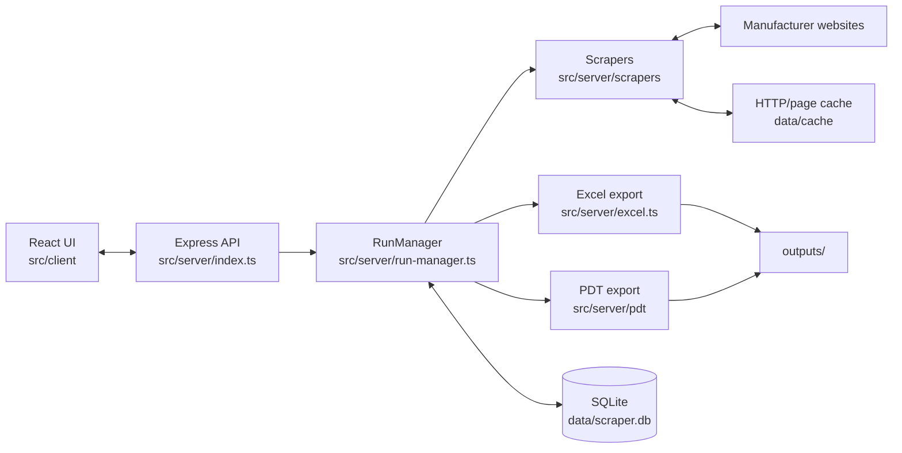
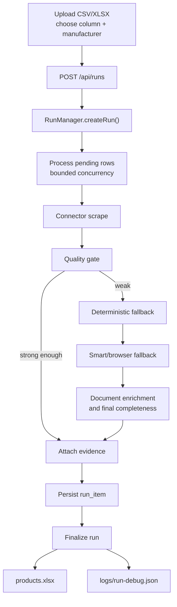
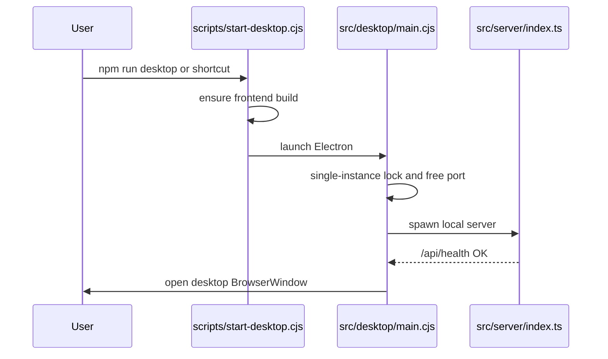
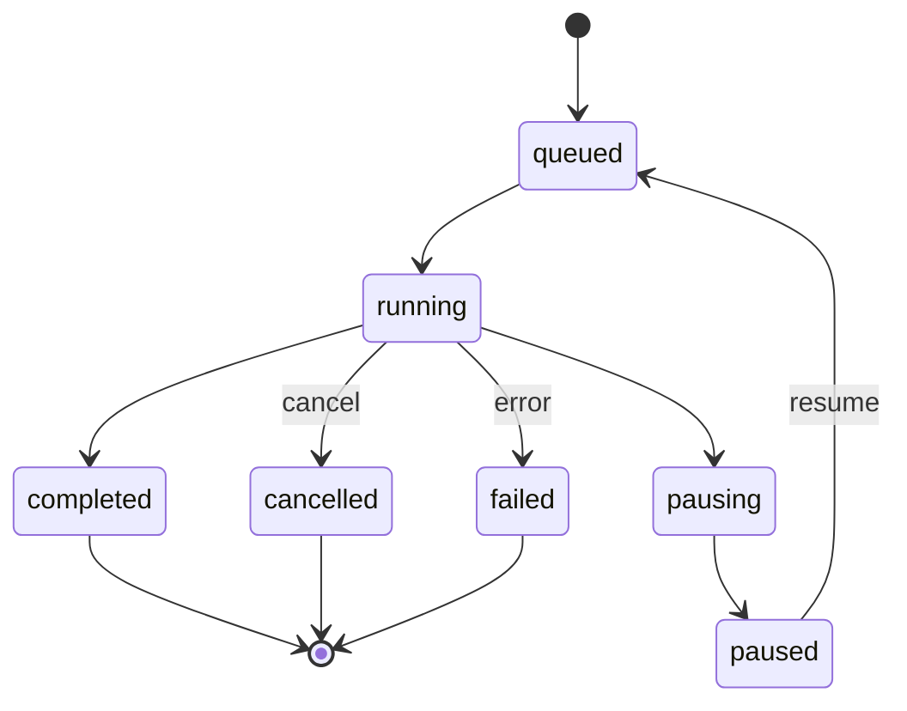

# Product Scraper Architecture

Technical notes for the local desktop scraper. This document is intentionally
checked against the current codebase; avoid treating it as marketing copy.

## Accuracy Notes

- The app is local and needs no cloud API key for normal scraping, but it is not
  "fully offline" in the strict sense. It still makes outbound requests to
  manufacturer sites unless data is already cached or supplied by customer
  documents.
- Runtime LLM use is off by default. The optional PDT AI cleanup only runs when
  `PDT_AI_CLEANUP=1` and a local Ollama/Qwen setup is available.
- There are 14 built-in manufacturer profiles today. 12 have dedicated connector
  modules; `nvent` and `phoenix` use the config-driven fallback connector.
- Interrupted runs are auto-resumed only within the current safety window
  (`5 minutes` in `src/server/run-manager.ts`). Older interrupted runs are
  marked cancelled.

## What It Does

You upload a CSV or Excel file, choose the catalog-number column and select a
manufacturer. The app then:

1. Creates a local run in SQLite.
2. Scrapes official manufacturer sources first.
3. Uses configured fallbacks, discovery, rendered pages and document enrichment
   when the first result is weak.
4. Normalizes technical attributes without a runtime model call.
5. Grades each item with a quality gate.
6. Exports a traced `products.xlsx` workbook and, on demand, a PDT workbook.

The design goal is source-backed output. Values should come from scraped pages,
documents, customer uploads, parsed quantities or explicit deterministic rules.
Unknown values are left missing and surfaced in diagnostics instead of guessed.

## Runtime Shape



Electron starts the local server and opens a desktop window. The API listens on
`127.0.0.1`; it is private to the machine and is not a public service.

## End-To-End Run



Important fast paths:

- Images-only runs skip Excel generation, broad fallbacks and PDF enrichment.
- Links-only runs can produce discovered product URLs without image/document
  downloads.
- Customer documents are moved into the run folder and treated as authoritative
  overrides for the run.

## Manufacturer Support

Built-in manufacturer profiles live in
[`src/server/config/manufacturers.ts`](../src/server/config/manufacturers.ts).

Dedicated connector modules are registered in
[`src/server/scrapers/index.ts`](../src/server/scrapers/index.ts):

| Manufacturer | ID | Connector |
| --- | --- | --- |
| ABB | `abb` | `abb.ts` |
| Balluff | `balluff` | `balluff.ts` |
| Eaton | `eaton` | `eaton.ts` |
| E-T-A | `eta` | `eta.ts` |
| FATH | `fath` | `fath.ts` |
| Rockwell Automation | `rockwell` | `rockwell.ts` |
| Saginaw / SCE | `sce` | `sce.ts` |
| SCAME | `scame` | `scame.ts` |
| Schmersal | `schmersal` | `schmersal.ts` |
| Schneider Electric | `schneider` | `schneider.ts` |
| Siemens | `siemens` | `siemens.ts` |
| Spelsberg | `spelsberg` | `spelsberg.ts` |

Config-driven built-ins:

| Manufacturer | ID | Notes |
| --- | --- | --- |
| nVent / Hoffman | `nvent` | Built-in profile using configured URL templates/fallbacks |
| Phoenix Contact | `phoenix` | Built-in profile using configured URL templates/fallbacks |

Custom manufacturers are saved in `data/manufacturers.json` and use the same
configured fallback connector. Their config can define URL templates, localized
templates, fallback sources, marker rules, discovery policy, interaction policy,
extraction policy, quality policy and fetch policy.

Legacy IDs are normalized in the config layer, for example `newabb -> abb`,
`saginawcontrol -> sce`, `schneiderelectric -> schneider`, and
`nventhoffman` / `eldon -> nvent`.

## Shared Scraping Infrastructure

| Module | Role |
| --- | --- |
| [`http-client.ts`](../src/server/scrapers/http-client.ts) | Cached GET/POST, retries, per-host throttling, page cache and file/image downloads |
| [`browser-renderer.ts`](../src/server/scrapers/browser-renderer.ts) | Playwright Chromium rendering for JS-heavy pages and modal/tab interactions |
| [`discovery.ts`](../src/server/scrapers/discovery.ts) | Official URL discovery from templates, search pages, sitemaps, learned endpoints and URL variants |
| [`link-discovery.ts`](../src/server/scrapers/link-discovery.ts) | Catalog-number-aware link filtering and scoring |
| [`learned-endpoints.ts`](../src/server/scrapers/learned-endpoints.ts) | Stores successful official API URL patterns in SQLite for later replay |
| [`evidence.ts`](../src/server/scrapers/evidence.ts) | Attaches source/parser/stage/confidence records to values |
| [`dedupe.ts`](../src/server/scrapers/dedupe.ts) | Merges duplicate attributes/documents while preserving higher confidence data |

Concurrency is manufacturer-specific (`ManufacturerConfig.concurrency`) and
defaults to 3, capped at 8. Per-host throttling is derived from
`ManufacturerConfig.rateLimitMs`.

## Understanding Engine

The normalization layer is deterministic. It keeps raw manufacturer attributes
unchanged and adds a technical/normalized view when it can recognize a meaning.

| Module | Role |
| --- | --- |
| [`ontology.ts`](../src/server/scrapers/ontology.ts) | Canonical property ontology, multilingual aliases and unmapped-label diagnostics |
| [`quantity.ts`](../src/server/scrapers/quantity.ts) | Quantity parsing, units, ranges, tolerances, AC/DC and sanity bounds |
| [`normalizer.ts`](../src/server/scrapers/normalizer.ts) | Normalized fields such as weight, dimensions, material, color, protection and temperature |
| [`technical-attributes.ts`](../src/server/scrapers/technical-attributes.ts) | Builds `ProductResult.technicalAttributes` from raw attributes |
| [`tight-context.ts`](../src/server/scrapers/tight-context.ts) | Selects the right variant column in comparison-style documents |
| [`device-type.ts`](../src/server/scrapers/device-type.ts) | Classifies products into PDT-relevant device types |

How to teach it more:

1. Add new property meaning to `PROPERTY_ONTOLOGY`.
2. Add new units or sanity bounds in `quantity.ts`.
3. Add material/color language terms in `normalizer.ts`.
4. Add tests before relying on the new mapping.

Do not add scattered one-off regexes for every product unless there is no more
general representation available.

## Quality Gate

[`quality-gate.ts`](../src/server/scrapers/quality-gate.ts) decides whether an
item is `found`, `partial` or `failed`.

It checks:

- catalog identity conflicts,
- required sections, attributes and documents from manufacturer config,
- normalized fields and device-type-aware requirements,
- source/document/section depth,
- confidence caps for distributor or weaker rendered data.

The quality gate records attempted stages and missing fields in
`ProductResult.qualityGate` and diagnostics. A weak result can trigger deeper
fallbacks.

## PDT Export

PDT export is generated on demand from the run result and
[`templates/master_pdt.xlsx`](../templates/master_pdt.xlsx).

Key modules:

| Module | Role |
| --- | --- |
| [`exporter.ts`](../src/server/pdt/exporter.ts) | Orchestrates PDT generation |
| [`device-sheet-map.ts`](../src/server/pdt/device-sheet-map.ts) | Constant sheets and device-specific routing |
| [`device-type-profiles.ts`](../src/server/pdt/device-type-profiles.ts) | Per-device target sheets and critical facts |
| [`eclass-resolvers.ts`](../src/server/pdt/eclass-resolvers.ts) | Resolves normalized attributes into PDT columns |
| [`documents-sheet.ts`](../src/server/pdt/documents-sheet.ts) | Adds downloaded/customer document references |
| [`ai-cleanup.ts`](../src/server/pdt/ai-cleanup.ts) | Optional local Ollama/Qwen cleanup, off by default |

`npm run audit:pdt` validates the template, resolver coverage, profile mapping,
ontology facts and benchmark fixtures.

## Storage And Output Layout

SQLite database:

```text
data/scraper.db
```

Main tables:

| Table | Holds |
| --- | --- |
| `runs` | Run status, counts, options and output paths |
| `run_items` | Per-row catalog result and serialized `ProductResult` |
| `page_cache` | Cached HTTP responses and fetched metadata |
| `learned_endpoints` | Successful official API/URL patterns |
| `exhausted_fields` | Fields previously confirmed missing for a catalog number |

Output folders are built by
[`src/server/run-output.ts`](../src/server/run-output.ts):

```text
outputs/
  <manufacturer-short-name>/
    <input-file-name-or-manual-input>/
      <yyyy-mm-dd_hh-mm-ss>_<runId>/
        excel/
        documents/
        cad/
        images/
        links/
        logs/
        customer-documents/
```

The main workbook filename is:

```text
<manufacturerShortName>.<inputName>.product-scrape-<runId>.xlsx
```

The workbook includes product rows, attributes, technical attributes, alias
dictionary, documents, sources, evidence, final audit and failure/diagnostic
worksheets.

## Desktop Boot



`scripts/start-desktop.cjs` sets `PDT_AI_CLEANUP=0` when the variable is not
already set. This keeps AI cleanup opt-in.

## Run Lifecycle



On server start, `resumeInterruptedRuns()` picks up recent `queued`, `running`,
`pausing` and `cancelling` runs. Runs older than the 5-minute interruption
window are cancelled to avoid silently resuming stale work.

## Commands

| Command | What it does |
| --- | --- |
| `npm run desktop` | Launches the Electron desktop app |
| `npm run dev` | Runs API watch mode and Vite UI |
| `npm run build` | Runs `tsc --noEmit` and Vite build |
| `npm test` | Runs Vitest |
| `npm run benchmark` | Runs benchmark fixtures and writes `benchmarks/benchmark-report.json` |
| `npm run audit:pdt` | Runs PDT/template/resolver audits |
| `npm run clean:pdt-input` | Cleans a raw PDT input workbook |

Before committing code changes, run:

```powershell
npx tsc --noEmit
npx vitest run
```
